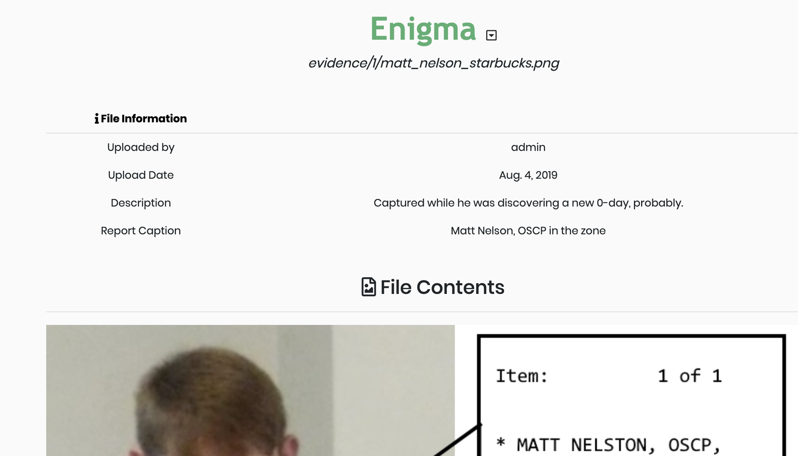
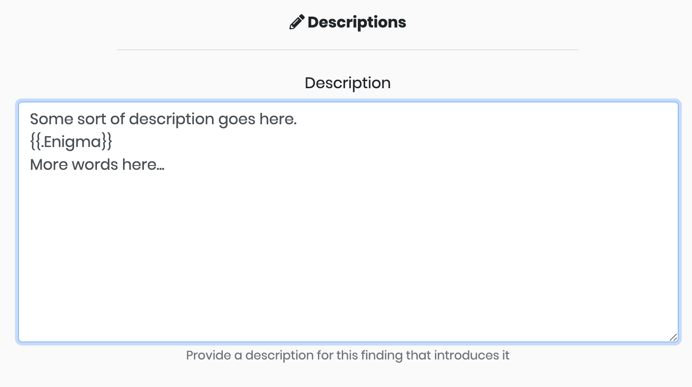

# Template Values for Findings


This markup language is under active development and will expand and change. This page will always have the most recent information.


## Introducing the Values

Ghostwriter's reporting engine supports a few types of template values you can use in your findings templates to dynamically format text or insert data at reporting time.

A reference pane is included at the top of the page when editing a finding in the library or a report.

### Using the Template Values

While editing a finding, add the template values mid-sentence or on new lines. Certain values do have specific requirements for placement, so read on to learn the basics of each.


Type `@` to initiate auto-complete! Typing `@{` will display a list of all available template values. The curly brace matches the first character of the template variables, leading to population of the autocomplete suggestions.


Ghostwriter will process the values when a report is generated. To use a value, read its description for usage instructions and place the `{{.VALUE}}` keyword in your finding template.


The `.` int `{{.VALUE}}` is important and easy to miss. This additional character is necessary to avoid processing other values inside of curly braces as variables. Some people use `{{ }}` as a way to denote sections of text that should be filled-in to use the template.


## Current Template Values

The following tables contains the current template values available for use in a finding:

| Keyword | Usage |
| :--- | :--- |
| {{.client}} | This keyword will be replaced with the client's short name. The full name will be used if a short name has not been set for the client. |
| {{.caption}} | Start a line of text with this keyword to make it a caption. This is intended to follow a code block. |
| {{.caption reference}} | Adding an alphanumeric string after `caption` \(and a space\) will place a bookmark that will link to the matching reference \(created with the `{{.ref ...}}` tag. |
| {{.ref ... }} | The "ref" tag places a bookmark that will link to the matching figure. Use evidence friendly names or the reference you provide a `{{.caption}}` tag. |


Use the caption and reference tags to create cross-references in Word reports. For example, if you have an evidence image with the name "Screenshot" you can place the evidence \(as shown below\) using:

`{{.Screenshot}}`

Anywhere else in the finding \(before or after `{{.Screenshot}}`\) you can place one or more references to that image to create bookmarks. Like this:

`{{.ref Screenshot}}`

The final Word document will have your evidence with a "field character" \(i.e., a reference like "Figure 1"\) and bookmarks \(i.e., cross-references\) to that field character. They will look and function just like cross-references inserted using Word's _Reference_ tab.

The same works with captions like this:

`{{.caption myReference}}` and `{.ref myReference}}`


### Inserting Evidence

Evidence files can be dynamically placed within a finding using the evidence file's **Friendly Name** value as a template value.

**Example**

An evidence file has been attached with the **Friendly Name** set to **Enigma**.

The **Friendly Name** is a more human-friendly name \(compared to the file path or a timestamped file name\) for referencing the evidence file. When referencing evidence in a template, enclose the **Friendly Name** in the curly braces, e.g. `{{.Enigma}}`, on a new line by itself.


There is no need for additional lines between the template value and the preceding or subsequent lines. Adding blank lines will just create blank lines in the report output. Let the formatting handle spacing between elements.


With the evidence template value in place, Ghostwriter will drop-in the evidence file in place of the template value when the report is generated. Additionally, Ghostwriter will add a border around the image and include the evidence file's **Report Caption** below the image as a proper Word caption.

If the evidence is an image, the reporting engine will insert it as an image, centered, and set to the width of the page \(6.5"\). You can change the sizing after the report is generated.

If the evidence is a text document of some kind \(e.g. log, txt, md\) it will be placed in the document using the Word template's **Code Block** style. Edit your template to make adjustments to the font and other formatting options.


The first time you open your Word report you will see the Figures lack their numbers. This is caused by how Word parses the XML. The Figures are fine, but you will need to tell Word to update them to see the numbering.

Select all text in the report, right-click, and select **Update Field**. The Figures will now appear properly.


