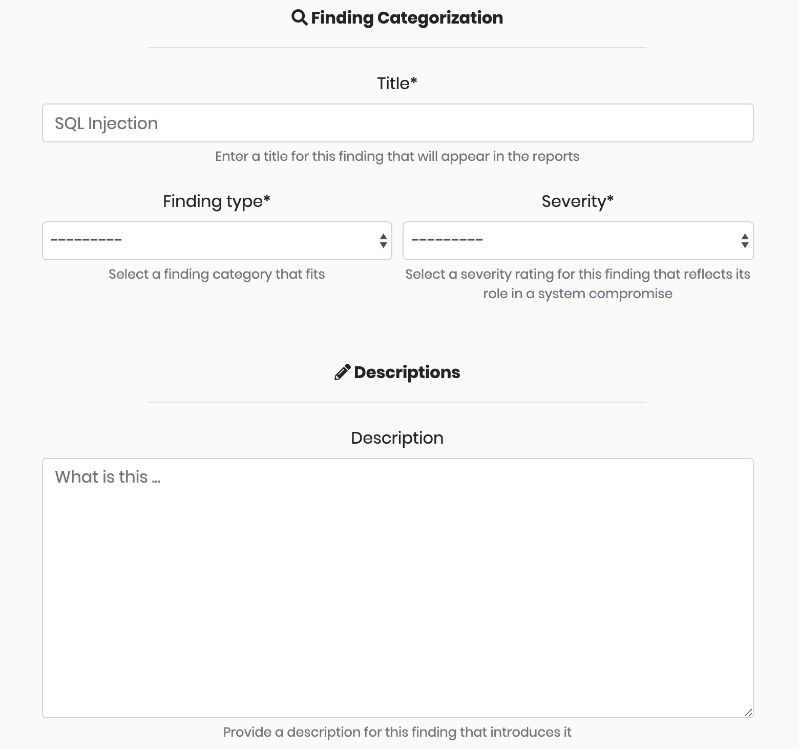

# Populating the Findings Library

Templates can be added to the library one at a time or loaded en masse from a csv file.



To add just one finding to the library, click the **Findings Library** tab on the menu bar and **Add New Finding**. This opens the finding form for documenting and submitting a single finding template.

The **Finding Guidance** field is not used in reports. Use this field to explain how a finding should be used or what sort of evidence should be included with it. The field can be left blank if you do not have anything for the finding.




To bulk add templates to the library, click the **Findings Library** tab on the menu bar and **Upload Bulk Findings**. This opens the upload form for your csv file. The csv file must have these headers:

_title, description, severity, impact, mitigation, replication\_steps, host\_detection\_techniques, network\_detection\_techniques, references, finding\_type, finding\_guidance_

The _finding\_guidance_ field is not used in reports. Use this field to explain how a finding should be used or what sort of evidence should be included with it. The field can be left blank if you do not have anything for the finding.


If a finding \(based on the _title_ field\) already exists in the library, the import will update the existing record instead of discarding the data or duplicating the entry.




