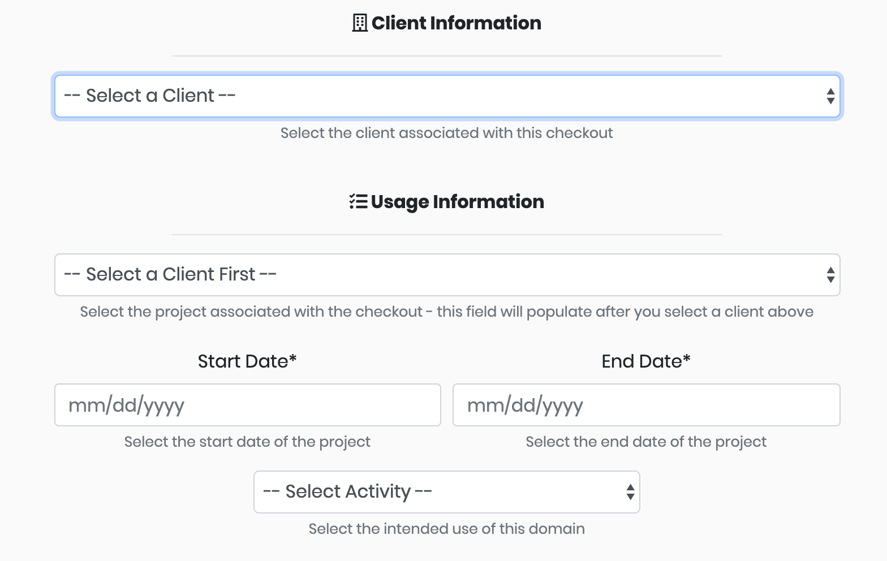

# Domain Checkout

## Checking-out a Domain

Any **Available** domain in the library can be checked out for a project. Click the calendar icon in the **Checkout** column to bring up the check-out form.

Each checkout requires selecting a client and a project. Select the client first to load the list of projects for that client.

Then click the **Start Date** and **End Date** fields to open the datepicker and select your checkout window.

The final step is filling in your usage information. Domains can be checked out for activities such as _Phishing_ and _Command and Control_.


Ghostwriter performs several operational security checks during the check-out process. The page will display a warning if:

* someone previously used the domain name with the selected client
* the domain name expires in less than 30 days and is not configured to auto-renew
* the domain name is marked as burned / has an undesirable category


