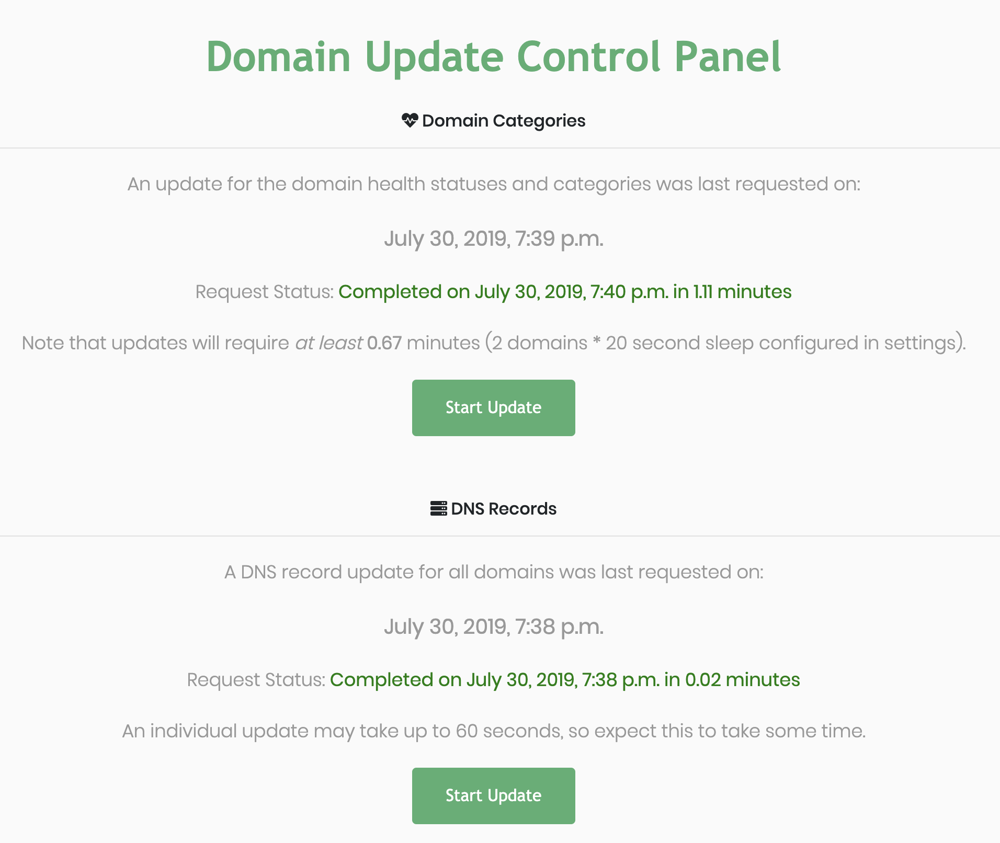

# Monitoring Domains

## Domain Health Checks

Ghostwriter grades a domain's health as **Healthy** or **Burned**. Health is based on domain categorization and VirusTotal information.

### Categorization Health

Domain categories are pulled from VirusTotal, which pulls categorization information from multiple sources. See the VirusTotal configuration for more information.




Ghostwriter tracks domain categories for all of these third-parties:

* Cisco Talos
* IBM Xforce
* Fortiguard
* Bluecoat
* OpenDNS
* Trendmicro

However, Ghostwriter only automatically updates the VirusTotal results. The other services do not offer APIs and actively block webscraping by using reCAPTCHAs and permanently banning  IP addresses. They ask the public to not scrape results and the Ghostwriter project honors that request.


Ghostwriter These categories are bad and any source flagging a domain with one of these categories will trigger the health status to flip to **Burned**:

* spam
* phishing
* gambling
* suspicious
* pornography
* placeholders
* web ads/analytics
* scam/questionable/illegal
* malicious sources/malnets


Most of these categories are self-explanatory, but some ⁠— like gambling ⁠— may not seem like they belong.

* **Placeholders:** This often appears when a domain's category is undetermined. It translates to Uncategorized, and may mean the domain is under review.
* **Gambling:** Not malicious, but likely blocked in a corporate environment.



If a domain is flagged as **Burned** it may still be recoverable. If you have a domain you really like, it may be worth trying to get it recategorized and continuing to monitor its reputation to determine if it can be used after a cool-off period.


### Additional Checks

The infrastructure manager also references _malwaredomains.com_ to check if one of your domain names appears in their list of malicious domains.

## Domain DNS Updates

You can also track the current DNS records for your domain names. Ghostwriter pulls this information using DNS queries.


These queries will not return subdomain records. You will have to manually track subdomains or use your registrar's API \(if available\) to pull these records.

You can edit or add tasks to _tasks.py_ to leverage an API.


## Queuing Domain Updates


Scheduling these tasks will keep records up-to-date without requiring any user interaction.




Domain update tasks exist in the `tasks.py`. These functions can be scheduled or requested manually.



The **Domain Update Control Panel** lives at `/shepherd/update` and provides information on when the updates were last run, how long they took to complete, and their exit state \(success or error messages\).

Click the **Start Update** button under the desired check to queue a check for _all domains_.



To update domain information or DNS records for just a single domain, open the domain's details and expand the **Health and Categories** or **DNS Records** panes.

Each of these panes contains a **Refresh** button. Click this button to queue an update for just the one domain.



