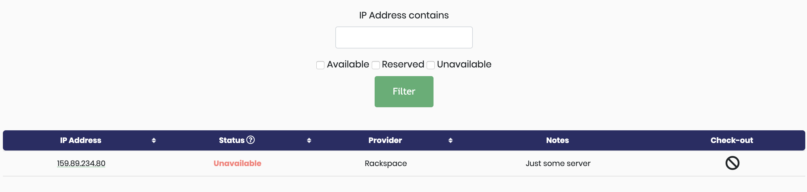
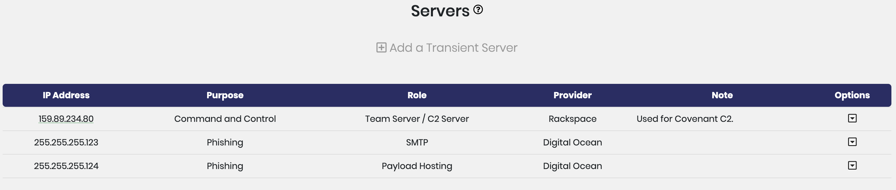

# Server Management

## The Server Library

The server library lives at `/shepherd/servers/`. The library is where users can view the current status of each server and checkout a server for a project.

### Types of Servers

The infrastructure manager tracks static servers and transient servers.

The server library tracks servers in the `StaticServer` model. These _static_ servers are intended to be servers you own, such as your command control teamservers.

The `TransientServer` model tracks _transient_ servers, the various cloud servers/virtual private servers that come and go during assessments. These servers are added to specific projects from the project details page using the **Add a Transient Server** button.

