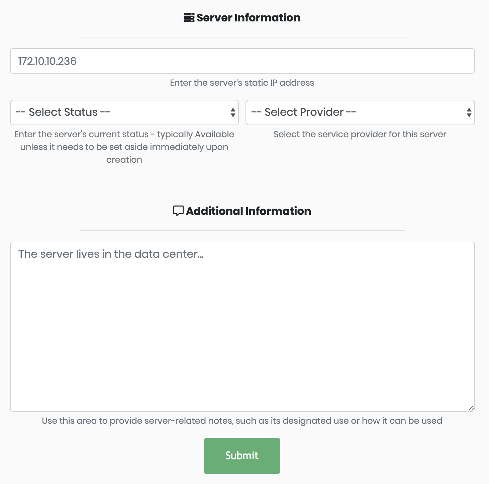

# Populating the Server Library

## Adding Servers

Servers can be added to the library one at a time or loaded en masse from a csv file.



To add just one server to the library, click the **Servers** tab on the menu bar and **Add New Server**. This opens the server form for documenting and submitting a single server.




To bulk add servers to the library, visit the admin panel and navigate to the **Static Servers** model.  Click the **Import** button and follow the on-screen instructions.

You can upload csv, xls, xlsx, tsv, json, and yaml files. Select the matching format from the dropdown menu.

After a moment, the admin panel will display a diff screen and ask you to approve the changes.


If a server already exists in the library, the import will update the existing record instead of discarding the data or duplicating the entry.




### Add Server Providers

The infrastructure manager is seeded with a handful of popular server providers:

* Linode
* Rackspace
* Digital Ocean
* Microsoft Azure
* Amazon Web Services
* Google Compute Engine

If your server provider is not pre-populated, new providers can be added via the Django admin panel, `/admin/shepherd/serverprovider/`.

