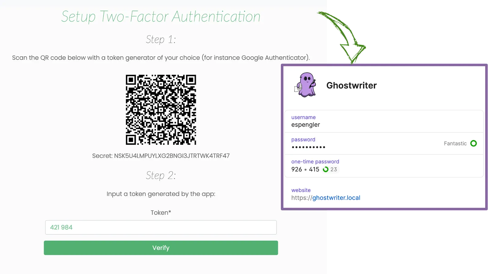

# Interacting with the Operation Log Table

Once you are on the log entries page, you will be presented with an empty table. The following sections outline how to interact with the table and log entries.


There will be times when you will need the log's unique ID. The ID number is always displayed at the top of the page, below the log's name.


### Creating an Entry

To manually create an entry, click on the "Create a new entry" button in the top right corner:

<figure><figcaption>
Operation Log View Controls and Filtering
</figcaption></figure>

You will notice a new row is populated with the current UTC timestamps and your username in the _Operator_ field_._

<figure><figcaption>
New Log Entry with Pre-Populated Fields
</figcaption></figure>

### Modifying an Entry

You can modify fields by double-clicking the table row you want to edit. A modal form will open:

<figure><figcaption>
Modal Form for Editing a Log Entry
</figcaption></figure>

Once you submit a change, the edits will sync via WebSockets and be visible to anyone with the log open.

### Copying & Deleting Entries

<figure><figcaption>
Copy and Delete Buttons for Log Entries
</figcaption></figure>

The _Options_ column is home to two buttons: copy and delete. The _copy_ button will create a clone of the selected entry. The _delete_ button will remove the log entry.

### Modifying the Table View

Log entries contain fields useful for tracking but can be too much for a table view, especially if you're viewing the log in a smaller browser window or a VM. You can customize the columns displayed by clicking the _Show/Hide Columns_ button and toggling columns on and off.

<figure><figcaption>
Table Column Selection and Customization
</figcaption></figure>

### Filtering Entries

The log table provides a search bar to filter entries containing only the provided text. This filter helps you view log entries related to a specific user, host, or command. To use the filter bar, type in the keyword. The filter is applied as you type, so you can keep typing to narrow down the results further.

<figure><figcaption>
Filtering Log Entries Based on Keywords
</figcaption></figure>


Note that text search will include columns you may have hidden. The filter is also limited to the currently loaded log entries. If you don't find what you want, scroll down to load additional entries and try filtering again.


### Connection Status Indicator

In the top right corner, there is a connection status indicator:

<figure><figcaption>
WebSockets Status Indicator
</figcaption></figure>

Since all entries are created/modified/deleted using WebSockets, a persistent connection is maintained. If the connection is ever lost, the connection status will turn red and indicate that the WebSocket connection is disconnected. When disconnected, you will not be able to create/modify/or delete any rows.

### Applying Tags to Log Entries

Like many objects in Ghostwriter, you can add tags to a log entry to help with filtering and tracking. The log table will change how certain tags appear in the table:

<figure><figcaption>
Example of Tags Displayed for a Log Entry
</figcaption></figure>

Tags that include:

* `att&ck`, `attack`, `mitre`, or `ttp` will appear as red tags (e.g., `ttp:t1549`)
* `creds` or  `credentials` will appear as yellow tags
* `vuln` will appear as green tags (e.g., `vulnerable:DotNetPE`)
* `detect` will appear as blue tags (e.g., `detected`)
* `objective` will appear as purple tags (e.g., `objective:1`)


Additional styles may be added in the future for different tags. The development is open to suggestions.


### Muting Log Notifications

By default, all new operation logs have notifications enabled. The optional [Operation Log Monitor task](../background-tasks/) handles notifications. If desired, a user with the `admin` or `manager` role can mute notifications from the hamburger menu in the upper-right corner of the logging page.

Notification status is also displayed in the operation logs table:

<figure><figcaption>
Log Notification Status in the Logs Table
</figcaption></figure>
