# Interacting with the oplog table

Once you are on the oplog entries page, you will be presented with an empty table. To start, we will create an entry.

### Creating an entry

To manually create an entry, click on the "Create a new entry" button in the top right corner:

   

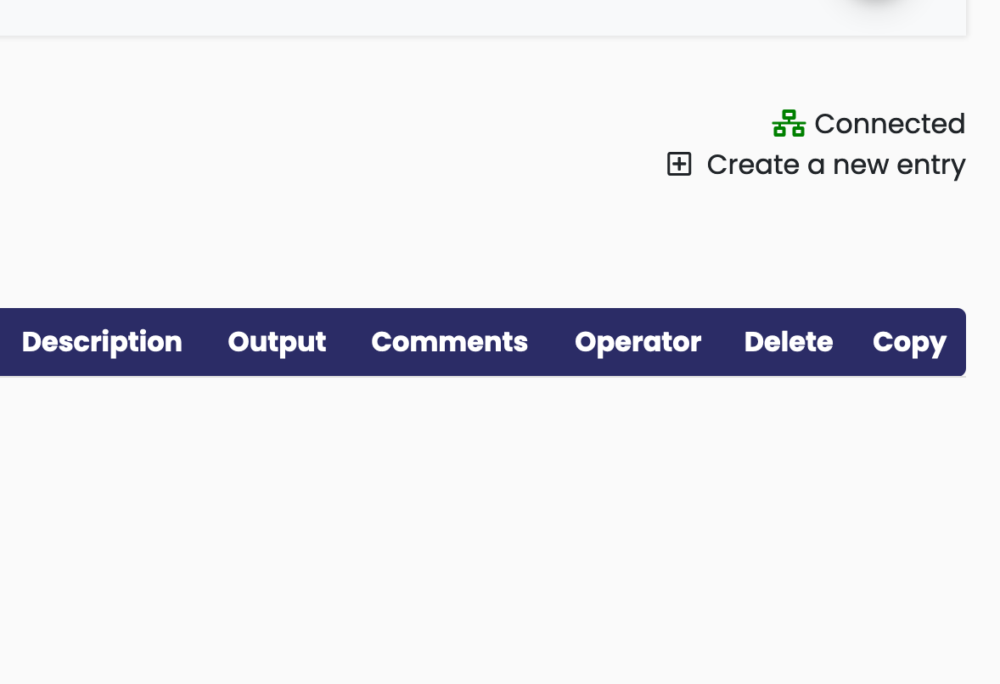

You will notice a new row is populated and the timestamps will be populated with the current UTC time. The ID field will also be populated. This is the unique ID of the entry and cannot be changed.

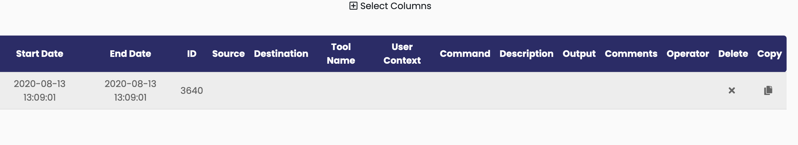

### Modifying an entry

Now that we have a new row, we should modify some fields. The easiest way to do this is to double click on any modifiable field. On double-click, you will be presented with a text box where you can modify the contents. For this example, I am changing the empty tool field to "beacon" to indicate that this command was executed on a CobaltStrike beacon:

   

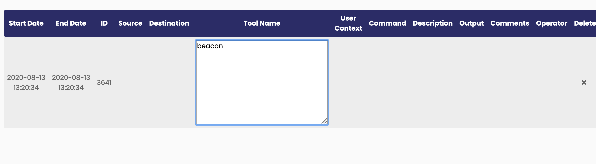

When modifying many cells simultaneously, using a mouse can be tedious, so the user can also use the keyboard to make entries. Using the arrow keys, a user can highlight the desired cell and press the **Enter** key to modify a cell. In this example, we will use the arrow key to navigate from Tool Name to the Command column and enter the command. When finished, press the **Tab** key to finish editing:

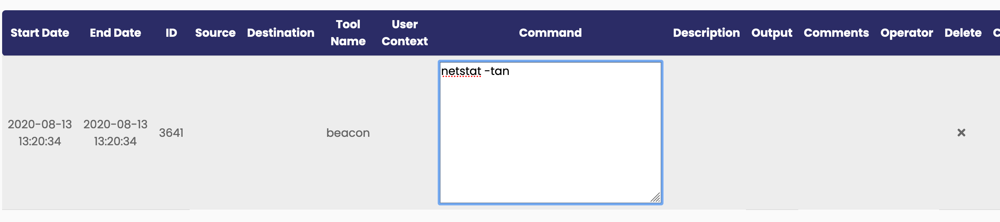

### Copying an entry

Many times it is desired to copy an entry because a command was executed multiple times with only small differences. To do this, a user can click the "copy" button on any given row to copy it: 

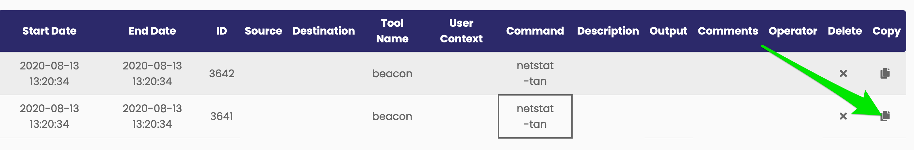

### Deleting an entry

To delete an entry, click the X in the delete column:

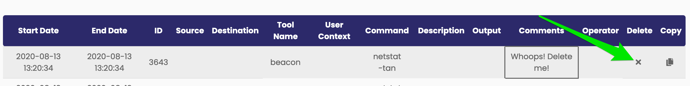

### Modifying the table view

It may be the case that many columns have identical information and are not providing useful information while taking up screen space. To remedy this, the user can select which columns are displayed by using the column selector above the table. To use the column selector, click on the "Select Columns" button at the top of the page. A series of check boxes will appear, which allows the user to select which columns should be visible. In order to hide a column, deselect the appropriate checkbox:

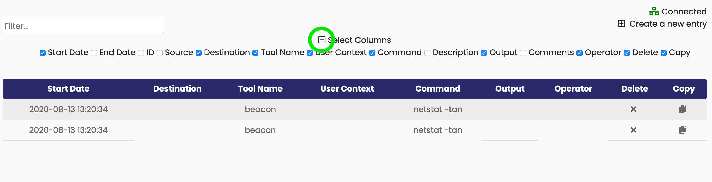

### Filtering entries

The oplog table provides a search bar to filter out entries that only contain the provided text. This is intended to be used to find commands with specific keywords or output that contains a certain string. To use the filter bar, simply type in text you are searching for:

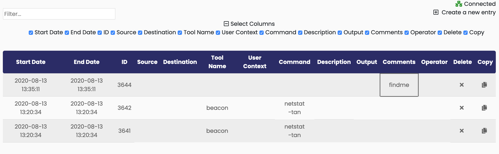

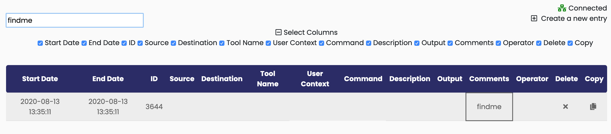

Note that text search will still include columns that are hidden.

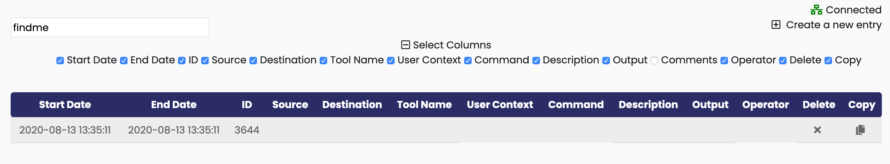

### Connection status indicator

In the top right corner there is a connection status indicator. 

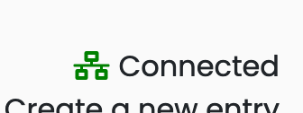

Since all entries are created/modified/deleted using websockets, a persistent connection is maintained. If the connection is ever lost, the connection status will turn red and indicate that the websocket connection is disconnected. When disconnected, you will not be able to create/modify/or delete any rows.

