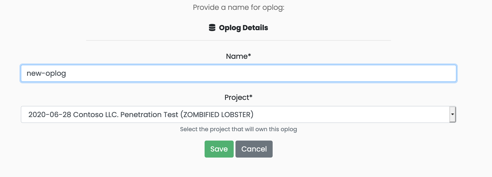

# Creating a new oplog

In order to create a new oplog, navigate to the oplog section on the left tool bar and select the "Create Oplog" button.

You will be prompted to enter a name and select the project to which this oplog belongs. While the name doesn't need to be unique to Ghostwriter, it does need to be unique to the project. In this example, we created a new oplog named "new-oplog".

Click "Save" when you are done and you will be taken to the oplog summary page.

On the oplog summary page, click on the link for "new-oplog" and you will be taken to the oplog entries table. This is where the user can view,create,modify, and delete entries.

