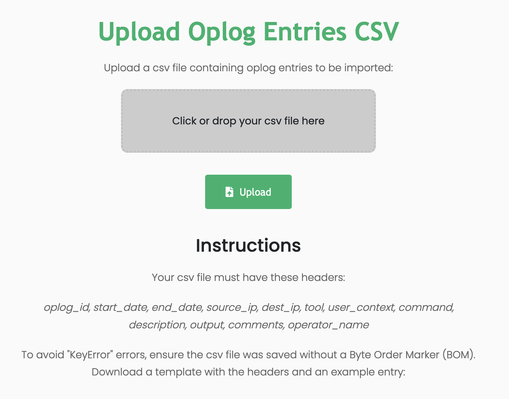

# Exporting / Importing Oplogs

### Exporting

A user can export an oplog by navigating to the oplog list and selecting export on the corresponding oplog.

The resulting downloaded file is a plain text CSV file.

### Importing

To import a CSV file, navigate to the "Import Oplog Entries" tab on the left toolbar. 

Click on the "Click or drop your csv file here" button and select a file to upload. Once the file is selected, click on the green upload button. You will be redirected to the oplog list page if successful, otherwise an error will be displayed indicating what went wrong during the import.

