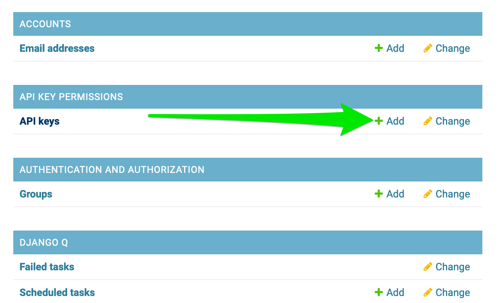
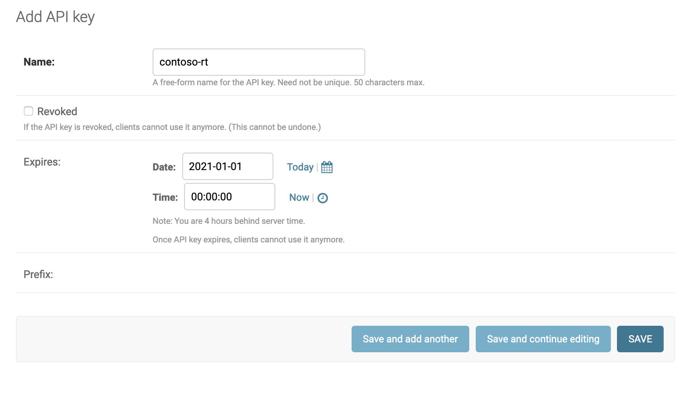
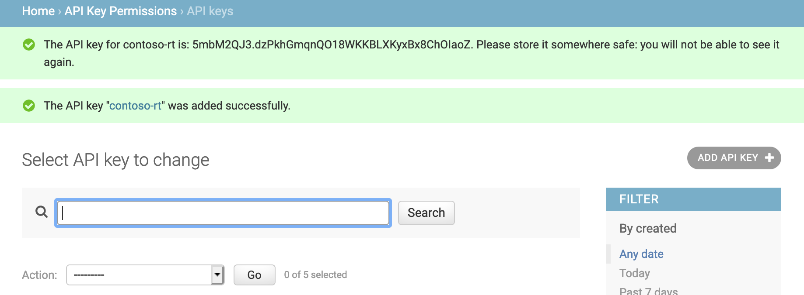

# Setting up Automated Logging

There are currently two different C2 frameworks we've built integrations for \(Mythic and Cobalt Strike\) that use the Ghostwriter REST API to automatically create and update Oplog entries.

## Obtaining an API Key

A new Ghostwriter API key is displayed automatically for you when you finish [creating a new oplog](creating-a-new-oplog.md). Be sure to save this key for configuration with the C2 syncing tools outlined below. If you missed this or have lost your API key, an administrator can follow the steps outlined in the next section to manually create a new key.

### Creating a New API Key

In order to use any automated logging solution, you will first need to create an API key. You must be admin to do this. First, navigate to the admin panel and click on the "Add" button in the API keys row.

You will be presented with a basic form that requires a name and optionally an expiration date. Set the appropriate fields and click save.

Once you hit save, a green toast message will appear and present you with the API key. This is the only time you will be presented with the plaintext API key, so write it down before you navigate away! Also, the period at the end of the API key is not a part of the API key and shouldn't be included.

## Setting up Syncing with Cobalt Strike



  
Clone the [cobalt\_sync project](https://github.com/GhostManager/cobalt_sync) to your Cobalt Strike teamserver and follow the instructions contained in the [README](https://github.com/GhostManager/cobalt_sync/blob/main/README.md) to enable syncing for each Cobalt Strike teamserver you deploy.

To integrate Cobalt Strike with the Ghostwriter Oplog API, we have released a server side aggressor script that will post any command to the Ghostwriter server. In order to set this up, clone the [_oplog.cna_](https://github.com/GhostManager/cobalt_sync) script to your teamserver and make sure that it is loaded by `agscript`. In this file, there are a series of placeholder Ghostwriter variables that you must set. These variables include:

* $oplog::GhostwriterOplogURL - The base URL of the Ghostwriter server without any paths or trailing "/" \(e.g., _https://ghostwriter.contoso.com_\)
* $oplog::GhostwriterOplogID - This needs to be set to the corresponding Oplog ID
* $oplog::GhostwriterOplogAPIKey - This needs to be set to the API key generated above

Once the script is loaded by `agscript`, every command entered in an interactive beacon will be forwarded to Ghostwriter and immediately displayed in the Oplog table.

* _The original gist for oplog-sync.cna released with GW 2.0 is located at_ [_https://gist.github.com/hotnops/e19a42a792950f4ef996d75a6e1bae35_](https://gist.github.com/hotnops/e19a42a792950f4ef996d75a6e1bae35)_, but is no longer updated._


**Note**: Cobalt Strike does not associate console output with the original command. Therefore, the Aggressor script is unable to automatically complete the output fields for Oplog entries.


## Setting up Syncing with Mythic



Clone the [mythic\_sync project](https://github.com/GhostManager/mythic_sync) to your Mythic C2 server and follow the instructions contained in the README to enable syncing for each Mythic server you deploy.


**Note**: Since Mythic associates output with the original command, the _mythic\_sync_ project will retroactively update previous Oplog entries when output is received. _This will overwrite any additional context that was added to the original entry within Ghostwriter before the new output was received._


