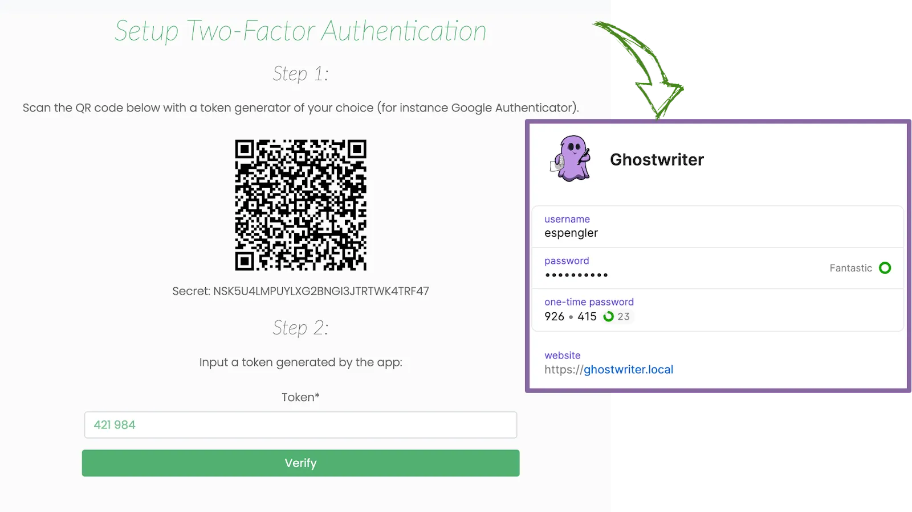

# Report Types

## Introducing the Report Types

Ghostwriter supports a variety of report types:

* Raw JSON
* Microsoft Office 2019 / 365
  * Word \(docx\)
  * Excel \(xlsx\)
  * PowerPoint \(pptx\)

### Selecting a Report Type

While viewing a report, scroll down to the **Generate Reports** section to configure your report and select the type of report you want.



### JSON

The JSON output is the foundation of every other report type. It is surfaced as a report type to enable users to take it and create custom reports and visualizations.


```text
{
  "client": {
    "id": 1,
    "full_name": "Kabletown",
    "short_name": "KT",
    "codename": "SCHEMING RANGER",
    "poc": {
      "1": {
        "id": 1,
        "name": "John Francis Donaghy",
        "job_title": "Vice President of East Coast Television and Microwave Oven Programming",
        "email": "jack@nbc.com",
        "phone": "555-123-4556",
        "note": "Goes by \"Jack.\""
      },
    }
  },
  "project": {
    "id": 1,
    "name": "Kabletown Penetration Test (GREATER THUNDER)",
    "start_date": "2019-07-29",
    "end_date": "2019-08-09",
    "codename": "GREATER THUNDER",
    "project_type": "Penetration Test",
    "note": ""
  },
  "findings": {
    "SMBv1 Remote Code Execution (CVE-2017-0143)": {
      "id": 1,
      "title": "SMBv1 Remote Code Execution (CVE-2017-0143)",
      "severity": "High",
      "affected_entities": "...",
      "description": "...",
      "impact": "...",
      "recommendation": "...",
      "replication_steps": "...",
      "host_detection_techniques": "...",
      "network_detection_techniques": "...",
      "references": "...",
      "evidence": {
        "Enigma": {
          "id": 5,
          "friendly_name": "Enigma",
          "uploaded_by": "admin",
          "upload_date": "2019-08-04",
          "description": "Captured while he was discovering a new 0-day, probably.",
          "caption": "Matt Nelson, OSCP in the zone",
          "url": "/media/evidence/1/matt_nelson.png",
          "file_path": "evidence/1/matt_nelson.png"
        }
      }
    },
  },
  "infrastructure": {
    "domains": {
      "1": {
        "id": 1,
        "name": "getghostwriter.io",
        "activity": "Command and Control",
        "operator": "admin",
        "start_date": "2019-07-15",
        "end_date": "2019-08-09",
        "note": "Used with Covenant C2."
      }
    },
    "servers": {
      "static": {
        "1": {
          "id": 1,
          "ip_address": "159.89.234.80",
          "activity": "Command and Control",
          "role": "Team Server / C2 Server",
          "operator": "benny",
          "start_date": "2019-07-29",
          "end_date": "2019-08-09",
          "note": "Used for Covenant C2."
        }
      },
      "cloud": {
        "1": {
          "id": 1,
          "ip_address": "255.255.255.123",
          "activity": "Phishing",
          "role": "SMTP",
          "operator": "benny",
          "note": ""
        },
      },
    },
    "domains_and_servers": {
      "1": {
        "domain": "code.getghostwriter.io",
        "servers": "255.255.255.123",
        "cdn_endpoint": "ghost-cdn.azureedge.net"
      },
    }
  },
  "team": {
    "1": {
      "id": 1,
      "name": "Benny Ghostwriter",
      "project_role": "Assessment Lead",
      "email": "benny@ghostwriter.wiki",
      "start_date": "2019-07-29",
      "end_date": "2019-08-09",
      "note": "..."
    },
  }
}
```


### Office Documents

Microsoft Office is ubiquitous and a staple of many reporting workflows. To that end, Ghostwriter's reporting engine supports construction and export of all three of the major Office filetypes: Word documents, Excel spreadsheets, and PowerPoint slide decks.

You can customize each of these so the exported files fit your specific needs.

#### Word Documents

For Word, Ghostwriter renders a _docx_ file using the JSON data and a report template document. Review the Word section for more information on customization options and how to get started generating Word documents.



#### PowerPoint Slide Decks

For PowerPoint, Ghostwriter renders a _pptx_ file using the JSON data and a slide deck master. Review the PowerPoint section for more information on customization options and how to get started generating slide decks.




#### Excel Spreadsheets

For Excel, Ghostwriter renders an _xlsx_ file using the JSON data. Review the Excel section for more information on customization options.




